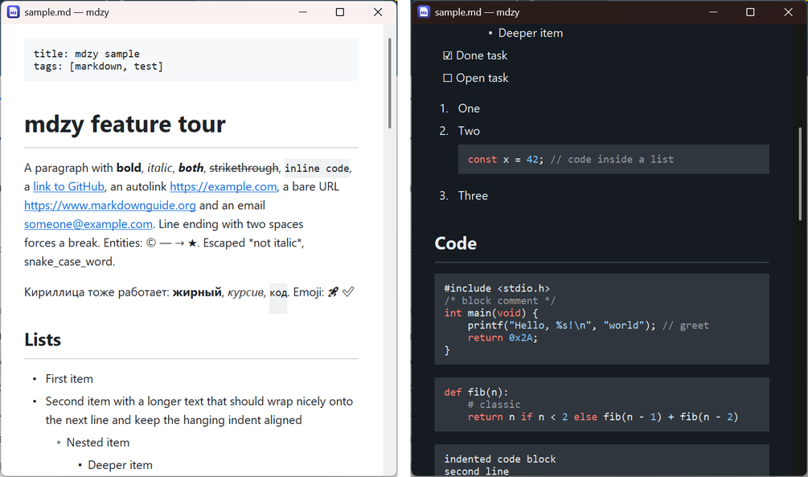

<p align="center">
  
</p>

<h1 align="center">mdzy</h1>

<p align="center">A tiny, instant Markdown &amp; text viewer for Windows. One ~240 KB exe, pure C/Win32, no dependencies.</p>



## Features

- **Instant start**: a native Win32 window with a RichEdit control; typical documents open in under 100 ms.
- **Markdown rendering** (GitHub flavoured): headings, emphasis, strikethrough, inline code, fenced and
  indented code blocks with light syntax highlighting, block quotes, GitHub alerts (`> [!NOTE]`...),
  ordered, unordered and task lists, tables with alignment, links, reference links, footnotes,
  YAML front matter, and common inline HTML (``, `<a>`, `<br>`, `<b>`, `<kbd>`, `<p align="center">`...).
- **Local images**: PNG and JPEG embedded directly, GIF, BMP, WebP, TIFF, ICO through WIC. Remote images show their alt text.
- **Plain text**: `.txt` and other text files open in a monospace view with UTF-8 / UTF-16 / ANSI detection. A 20 MB log opens in about 1.5 s.
- **Drag & drop** files onto the window. Dropping several files opens one window per file.
- **File associations**: per user, no admin rights needed.
- Relative `.md` links open in place with back and forward history; `#anchor` links jump to headings.
- Live reload when the file changes on disk, find (`Ctrl+F`), zoom, a source view, light and dark themes (follows Windows), always on top.

## Keyboard

| Keys | Action |
|---|---|
| `Ctrl+O` | Open a file |
| `F5` / `Ctrl+R` | Reload |
| `Ctrl+F`, `F3`, `Shift+F3` | Find, find next / previous |
| `Ctrl+U` | Toggle Markdown source view |
| `Ctrl+Plus` / `Ctrl+Minus` / `Ctrl+0`, `Ctrl+Wheel` | Zoom |
| `Ctrl+D` | Toggle dark / light theme |
| `Alt+Z` | Word wrap (plain text) |
| `Ctrl+T` | Always on top |
| `Alt+Left` / `Backspace`, `Alt+Right` | Back / forward |
| `Ctrl+E` | Open in an editor |
| `Ctrl+Shift+C` | Copy the file path |
| `F1` | Help |
| `Esc` / `Ctrl+W` | Close |

Arrow keys, `Space`, `PgUp`/`PgDn`, `Home`/`End` scroll. Right-click opens the menu.

## File associations

Right-click > **File associations > Register**, or run:

```
mdzy.exe --register
mdzy.exe --unregister
```

This registers mdzy under `HKCU` for `.md`, `.markdown`, `.mdown`, `.mkd`, `.mkdn`, `.mdwn` and `.txt`, adds it
to *Open with* and to *Settings > Default apps*. Windows 10 and 11 don't let applications make themselves
the default, so confirm it there (mdzy opens that page for you). If no program handles `.md` yet, mdzy
becomes its handler right away.

## Settings

Window position, zoom, theme, word wrap and always on top are saved to `%APPDATA%\mdzy\mdzy.ini`.
Create an empty `mdzy.ini` next to `mdzy.exe` to switch to portable mode.

## Building

With Visual Studio 2022 or its Build Tools (the C++ workload):

```
build.bat
```

With mingw-w64 (Linux cross-compile or an MSYS2 MinGW64 shell):

```
./build.sh
```

The output is `build\mdzy.exe`. `build.bat dev` builds a developer version with extra flags for automated
screenshots and tests (`--shot`, `--linktest`, `--bench`, `--rtf`).
`src/gen_icon.py` (requires Pillow) regenerates the icon.

## How it works

`src/mdzy.c` is the whole program. A small hand-written block and inline parser turns Markdown into RTF
(tables and code blocks become RichEdit table cells, images become embedded `\pict` data, links become
`HYPERLINK` fields), and the RTF is streamed into a read-only RichEdit (`msftedit.dll`) control that ships with Windows.

## License

MIT
